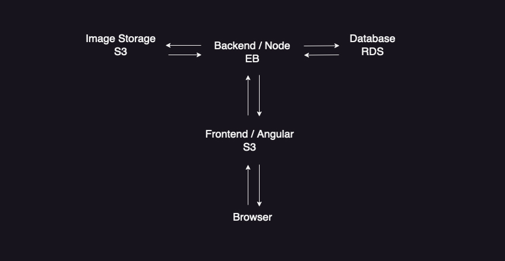
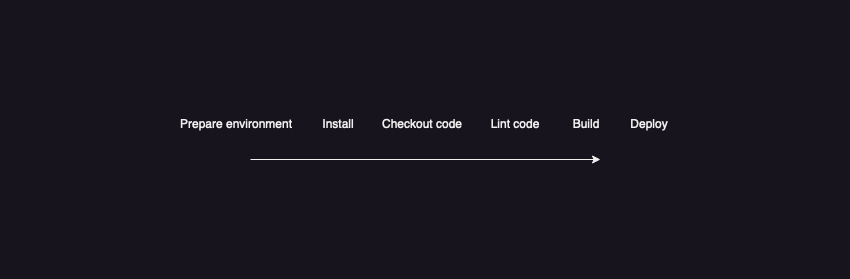
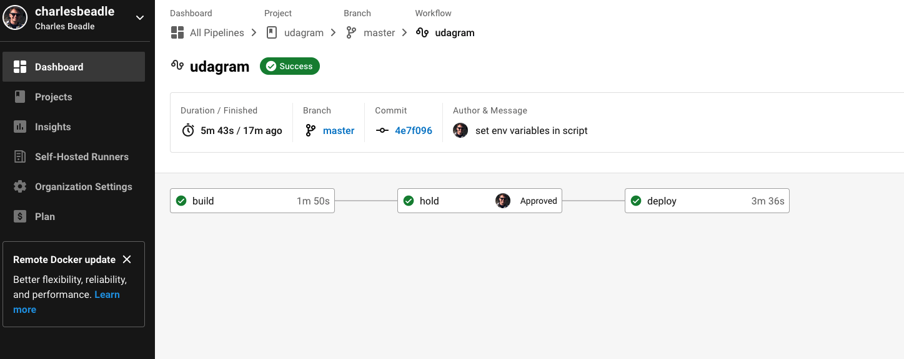
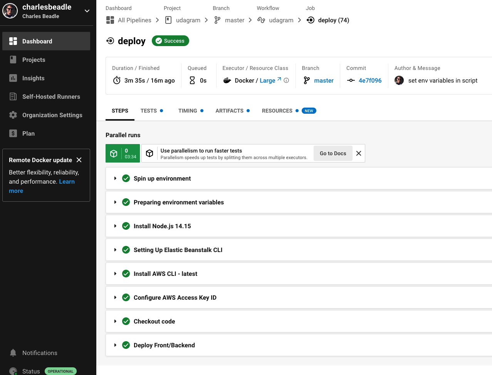
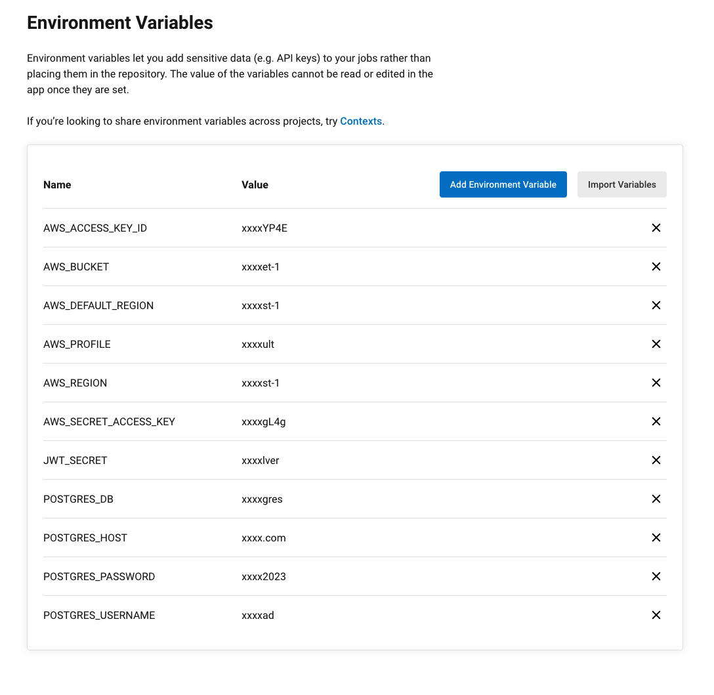
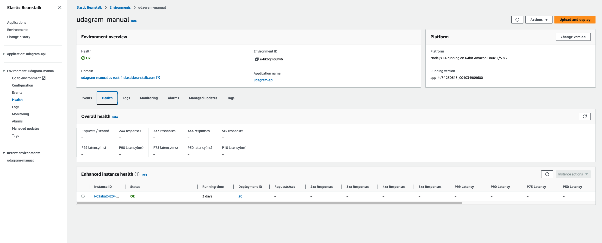
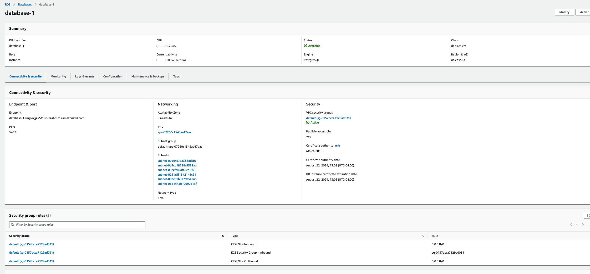
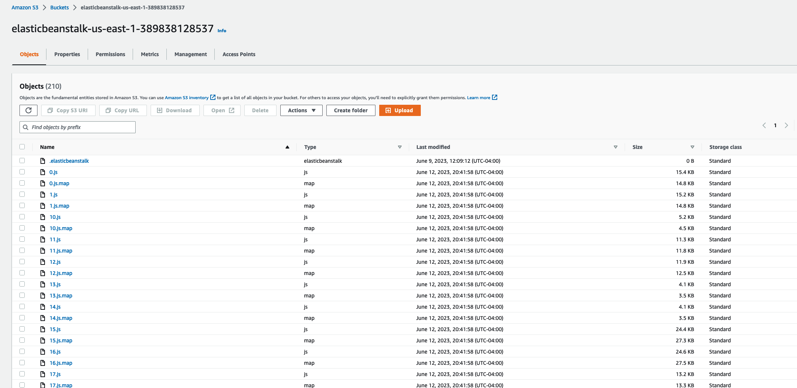
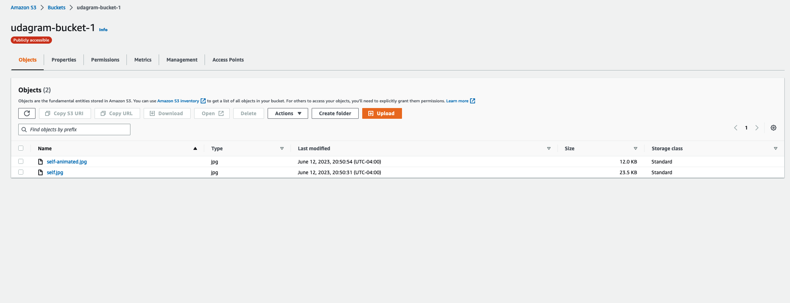

## Udagram

Udacity Full Stack JavaScript Developer Nanodegree Program

Project 4

The project application, Udagram - an Image Filtering application, allows users to register and log into a web client, post photos to the feed, and process photos using an image filtering service. It has two components:

    Frontend - Angular web application built with Ionic framework
    Backend RESTful API - Node-Typescript application

# [🔗 Link to the live hosted app](http://elasticbeanstalk-us-east-1-389838128537.s3-website-us-east-1.amazonaws.com)

Screenshots/Diagrams/Docs are in udagram/docs. I'll insert some of the images here for convenience

Architecture diagram

Workflow diagram

Deployment overview

Deployment

CircleCI Env Variables

Elastic Beanstalk

RDS

S3 App

S3 Media

